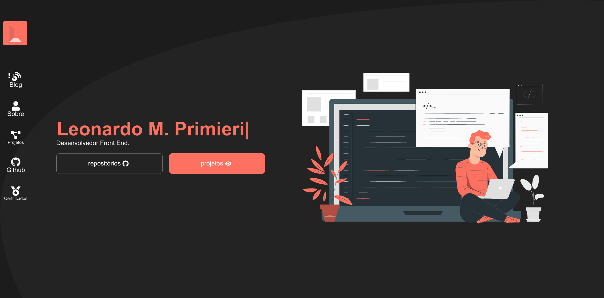

# Esse projeto foi feito com o inutito de demonstrar minhas habilidades

## 🚀 Funcionalidades

- Uso de API Fetch
- Uso de Context
- Responsividade

<h1 align="center">
    
</h1>

 
 
## 🚀 Techs

- [React](https://reactjs.org)

## Link do projeto: https://leonardoprimieri.vercel.app
